# Overview

**H**&#8203;eterogenous **EXA**&#8203;scale **P**&#8203;article-&#8203;**I**&#8203;n-&#8203;**C**&#8203;ell

Source code: https://github.com/LeCAD-PEG/hexapic

- **Language**: C++

- **Dependencies**: 
	- MPI
	- openPMD with ADIOS2 backend and Python support
	- PICMI (Python module)
	- pyqtgraph (Python module)

- **Target**: Fusion plasma, Scrape-Off-Layer of tokamaks.

- **Features**:
	- 2D3V electrostatic PIC
	- Full-orbit, Debye-sheath-resolving 
	- Multi-node MPI application
	- Domain decomposition
	- XOOPIC-like input file
	- Particle and heat sources: 
		- planar
		- volumetric
	- Multi-species
	- Monte-Carlo Collisions: 
		- elastic: &nbsp; e−&ndash;e−, &nbsp;&nbsp; e−&ndash;i+, &nbsp;&nbsp; e−&ndash;n0, &nbsp;&nbsp; i+&ndash;i+, &nbsp;&nbsp; i+&ndash;n0
		- excitation: &nbsp; e−&ndash;n0
		- ionization: &nbsp; e−&ndash;n0
		- charge-exchange: &nbsp; i+&ndash;n0
	- Plasma-surface interactions:
		- ion-recycling (into neutrals)
		- secondary-electron emmission
		- particle-impact erosion and impurity injection
	- 3D visualisation

  
  
  

  &nbsp; Space potential [V] &nbsp;&nbsp;&nbsp; &nbsp;&nbsp;&nbsp;&nbsp;&nbsp; Electron density [m−3] &nbsp;&nbsp;&nbsp;&nbsp;&nbsp;&nbsp; &nbsp;&nbsp; Electron temperature [eV]

- **Workflow**:

```plantuml
@startuml
start
:init; <<input>>
if (continue?) then (yes)
	:restore; <<load>>
else (no)
	:initial load; <<load>>
endif
repeat :inject particles; <<task>>
:charge to grid; <<task>>
:compute field; <<task>>
:move particles; <<task>>
:check boundaries; <<task>>
:collisions; <<task>>
split
	if (output?) then (yes)
		:diagnostics; <<output>>
	else (no)
	endif
split again
	if (checkpoint?) then (yes)
		:save state; <<save>>
	else (no)
	endif 
end split
repeat while (particles and/or steps?) is (yes) not (no)
:free; <<task>>
stop
@enduml
```

- **License**: [EUPL-1.2](https://interoperable-europe.ec.europa.eu/collection/eupl/eupl-text-eupl-12)