# Overview

**H** eterogenous **EXA** scale **P** article- **I** n- **C** ell

- **Language**: C++

- **Dependencies**: 
	- MPI
	- openPMD with ADIOS2 backend and Python support
	- PICMI (Python module)
	- pyqtgraph (Python module)

- **Target**: Fusion plasma, Scrape-Off-Layer of tokamaks.

- **Features**:
	- Full-orbit, Debye-sheath-resolving electrostatic PIC
	- Multi-node MPI application
	- Domain decomposition
	- XOOPIC-like input file
	- Particle and heat sources: planar, volumetric
	- Multi-species
	- Monte-Carlo Collisions
	- Plasma-surface interactions:
		- ion-recycling (into neutrals)
		- secondary-electron emmission
		- particle-impact erosion and impurity injection
	- 3D visualisation

- **Workflow**:

```plantuml
@startuml
start
:init; <<input>>
:initial load; <<load>>
repeat :inject particles; <<task>>
:charge to grid; <<task>>
:compute field; <<task>>
:move particles; <<task>>
:check boundaries; <<task>>
:collisions; <<task>>
split
	if (output?) then (yes)
		:diagnostics; <<output>>
	else (no)
	endif
split again
	if (checkpoint?) then (yes)
		:save state; <<save>>
	else (no)
	endif 
end split
repeat while (particles and/or steps?) is (Yes) not (No)
:free; <<task>>
stop
@enduml
```

