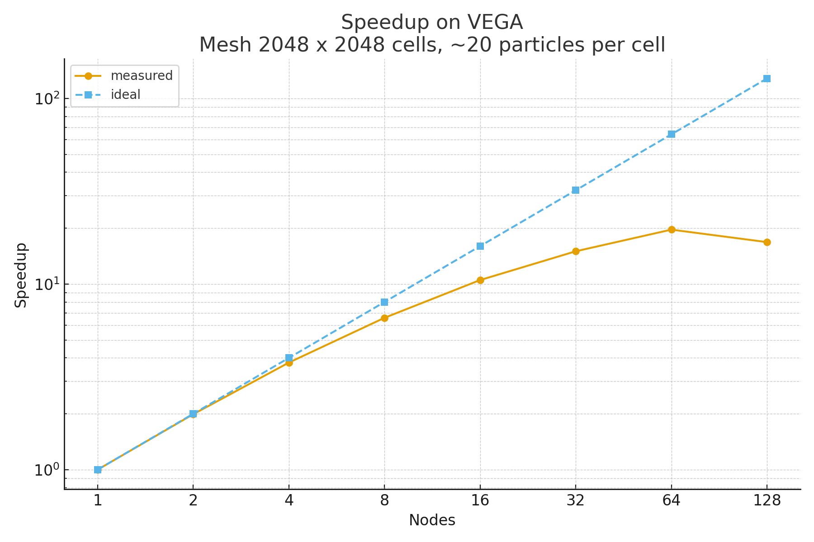
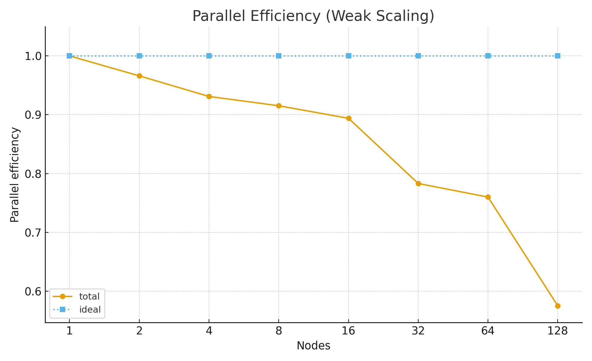

# Scaling v0.8.0

## VEGA HPC

128 cores/node.

See the machine website for more specifications: https://doc.vega.izum.si/general-spec/.

### Strong scaling

* Mesh size 2048x2048, single node RAM usage ~180 GB.

  

  

### Weak scaling

* Single node mesh size 2048x2048, single node RAM usage ~180 GB. 
* Mesh size increase 2048\*nodes, e.g.:
	- 1 node  : 2048x2048
	- 2 nodes : 2048x4096
	- 4 nodes : 4096x4096
	- etc...

  

  

